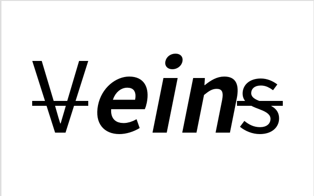
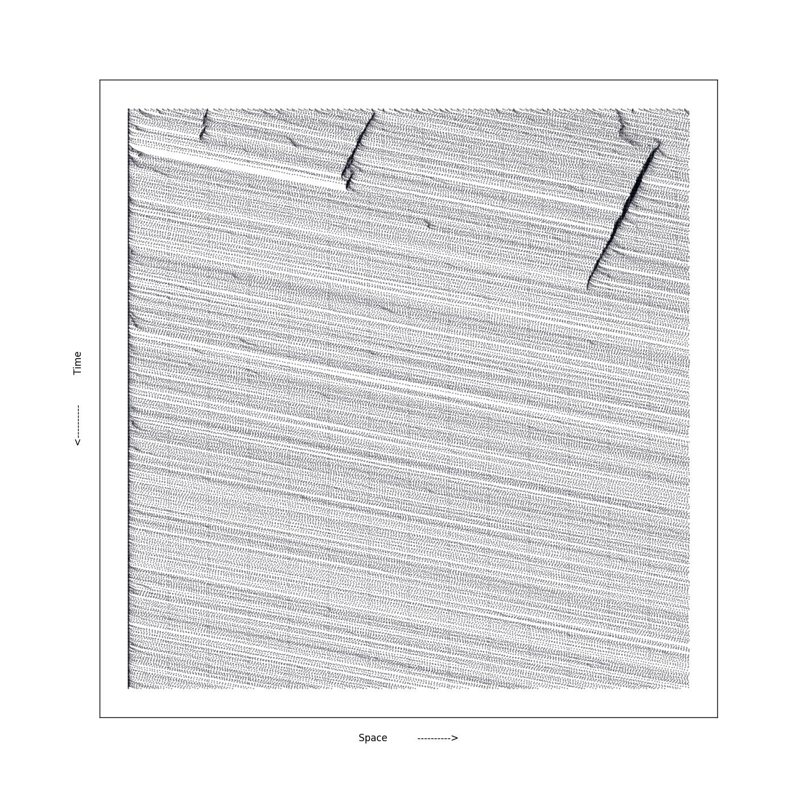

***

# Einspy - Simulations of Traffic System Based on the Theory of Cellular Automaton
***

## 项目介绍
* 道路交通流理论模型大体可分为三大类:宏观,中观,微观.  
元胞自动机属于微观模型,是集中于单个车辆在相互作用下的个体行为描述.  
主要用于研究高速公路与交通和城市网络交通.
* 该项目旨在提供一个简易上手且功能丰富的元胞自动机交通模拟库

## 文档与教程
[Einspy-Docs](http://veinsdocs.readthedocs.io/zh_CN/latest/index.html)

 ***
* A Ns Model Eg:

 ***  

## 依赖
* python 2.7
* matplotlib
* pandas>=0.19
* numpy
* colorama  

*[options]*
* seaborn

## 安装

> pip install einspy

## 其他
另外一个[Veins](https://github.com/sommer/veins)专业和复杂的多，如果有更高层次需求不妨去看看
